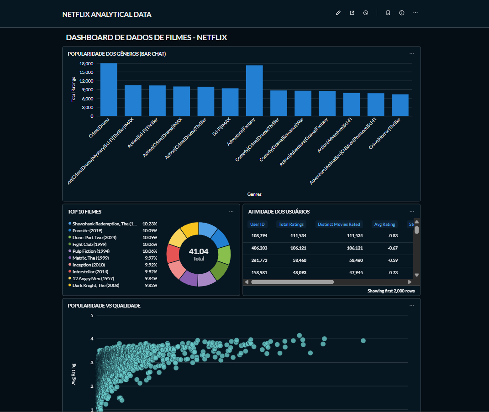
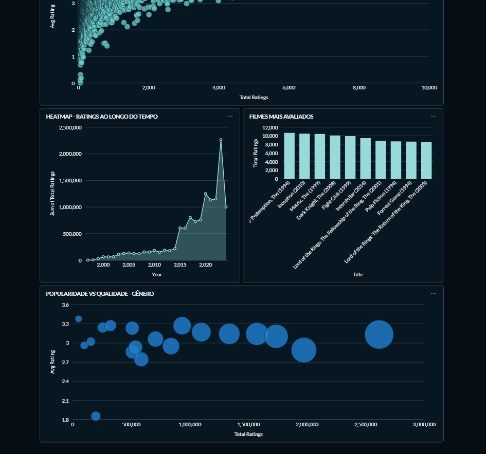

# Netflix Data Pipeline

End-to-end data engineering project that ingests raw Netflix-style movie rating data, processes it in a cloud data warehouse, and visualizes insights through a business intelligence dashboard.

This project demonstrates a complete modern data pipeline using cloud storage, data warehousing, and analytics tools.

---


## Dashboard

The final dashboard was built in Metabase to explore rating patterns and movie insights.






---


## Project Architecture

The pipeline follows a modern data architecture:

Raw Data → Data Lake → Data Warehouse → Analytics Dashboard

Technologies used:

- Google Cloud Storage (Data Lake)
- BigQuery (Data Warehouse)
- SQL (Data Modeling)
- Docker
- Metabase (Data Visualization)

---
Oficial link for the data used in the project: https://grouplens.org/datasets/movielens/ml_belief_2024/


## Data Pipeline Flow

1. Raw CSV datasets are stored in Google Cloud Storage.
2. External tables are created in BigQuery pointing to the raw files.
3. Data is transformed using SQL queries.
4. Dimensional tables and fact tables are created.
5. The analytical dataset is connected to Metabase.
6. Dashboards are created for data exploration.

Pipeline overview:

CSV Dataset → Google Cloud Storage → BigQuery External Tables → Data Warehouse → Metabase Dashboard

---

## Data Modeling

The project uses a simplified dimensional model.

Dimension Table:

dim_movies  
Contains movie information such as title, genres and release year.

Fact Table:

fact_ratings  
Stores user rating history with timestamps and movie references.

## Repository Structure
```
netflix-data-pipeline
│
├── data
│ └── compressed datasets used for the pipeline
│
├── sql
│ ├── external_tables.sql
│ ├── dim_tables.sql
│ └── fact_tables.sql
│
├── images
│ ├── dashboard_ratings.png
│ └── dashboard_movies.png
│
└── README.md
```

---

## Dataset

The original dataset used in this project exceeds GitHub's file size limits.  
For demonstration purposes, the dataset included in this repository is compressed.  
In a real environment the data pipeline reads directly from cloud storage.  

---

## What I Learned

- Building end-to-end data pipelines
- Creating external tables in BigQuery
- Data transformation with SQL
- Dimensional modeling (fact and dimension tables)
- Connecting a data warehouse to a BI tool

---

## Author

Pedro Rocha
Aspiring Data Analyst / Data Engineer passionate about data pipelines, analytics, and machine learning.
